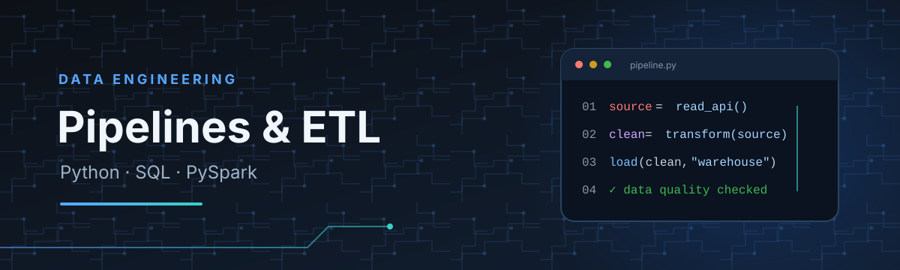

# João Pedro Medeiros Ferreira Andrade

**English 🇺🇸: Data Engineer · Data Pipelines & ETL**  
**Português 🇧🇷: Engenheiro de Dados · Pipelines & ETL**

Computer Engineering student at UniCEUB (expected 2027) · Estudante de Engenharia da Computação no UniCEUB (2027)  
Brasília, Brazil · English C1 (EF SET)

---

## 👋 About | Sobre

### English 🇺🇸

I’m a Data Engineer at NTT DATA Europe & Latam, building data pipelines and ETL solutions for financial-sector projects. I work with Python, SQL, PySpark, Apache Spark, Hive, and HDFS to integrate REST APIs and web-scraped data, process structured and unstructured information, and support data quality, incremental loads, data modeling, and reliable delivery.

### Português 🇧🇷

Sou Engenheiro de Dados na NTT DATA Europe & Latam, desenvolvendo pipelines e soluções ETL para projetos do setor financeiro. Trabalho com Python, SQL, PySpark, Apache Spark, Hive e HDFS para integrar APIs REST e dados coletados via web scraping, processar informações estruturadas e não estruturadas e apoiar a qualidade dos dados, as cargas incrementais, a modelagem e a disponibilização confiável das informações.

---

## 💼 Experience | Experiência

### 🏢 Data Engineer (Mid-level) · NTT DATA Europe & Latam
**May 2026 – Present**

**English 🇺🇸**

- Develop and maintain data pipelines and ETL solutions for financial-sector projects using Python, SQL, PySpark, Apache Spark, Hive, and HDFS.
- Integrate REST APIs and web-scraped sources, process structured and unstructured data, and build incremental loads.
- Perform data quality checks, data modeling, and technical documentation to support reliable data delivery.

**Português 🇧🇷**

- Desenvolvo e mantenho pipelines de dados e soluções ETL em projetos do setor financeiro, usando Python, SQL, PySpark, Apache Spark, Hive e HDFS.
- Integro APIs REST e fontes de web scraping, processo dados estruturados e não estruturados e implemento cargas incrementais.
- Realizo validações de qualidade, modelagem de dados e documentação técnica para apoiar a disponibilização confiável das informações.

---

### 🏢 Junior Data Engineer · NTT DATA Europe & Latam
**January 2026 – May 2026**

**English 🇺🇸**

- Built and maintained ETL pipelines with Python, SQL, PySpark, Apache Spark, Hive, and HDFS.
- Integrated REST API and web-scraping data, processed structured and unstructured sources, and implemented incremental loads.
- Supported data quality, table modeling, documentation, analytics, and automation.

**Português 🇧🇷**

- Desenvolvi e mantive pipelines ETL com Python, SQL, PySpark, Apache Spark, Hive e HDFS.
- Integrei dados de APIs REST e web scraping, processei fontes estruturadas e não estruturadas e implementei cargas incrementais.
- Apoiei atividades de qualidade dos dados, modelagem de tabelas, documentação, análises e automações.

---

### 🏢 Junior Data Engineer · Qintess
**October 2025 – January 2026**

**English 🇺🇸**

- Built and maintained ETL routines and SQL queries for data engineering projects in the financial sector.
- Performed data quality checks and table analysis with DBeaver and Apache Spark.
- Contributed to technical documentation and process traceability.

**Português 🇧🇷**

- Apoiei a construção e manutenção de rotinas ETL e consultas SQL em projetos de engenharia de dados do setor financeiro.
- Realizei validações de qualidade e análise de tabelas com DBeaver e Apache Spark.
- Contribuí com documentação técnica e rastreabilidade dos processos.

---

### 🎓 Data & AI Intern · Banco do Brasil
**August 2023 – October 2025**

**English 🇺🇸**

- Developed Power BI dashboards for financial analysis and operational management, including banking spread analysis, demand tracking, and team allocation views.
- Contributed to an AI solution for Scrum Masters: prepared historical user stories with PySpark for an LLM workflow and built a chatbot to generate user stories, acceptance criteria, and test scenarios from context summaries.

**Português 🇧🇷**

- Desenvolvi dashboards em Power BI para análises financeiras e gestão operacional, incluindo análise de spread bancário, acompanhamento de demandas e visão de alocação de equipes.
- Participei de uma solução de IA para Scrum Masters: preparei histórias de usuário históricas com PySpark para um fluxo com LLM e desenvolvi um chatbot para gerar histórias, critérios de aceitação e cenários de teste a partir de resumos de contexto.

---

## 🎓 Education | Formação

**Computer Engineering · UniCEUB**  
Expected graduation: 2027

**Engenharia da Computação · UniCEUB**  
Conclusão prevista: 2027

---

## 🧰 Technical skills | Competências técnicas

